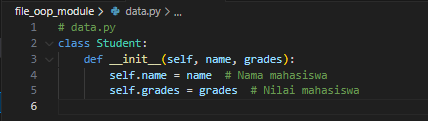
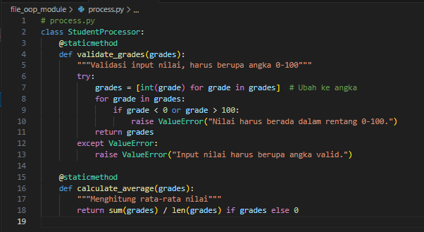
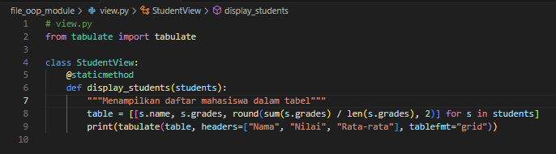
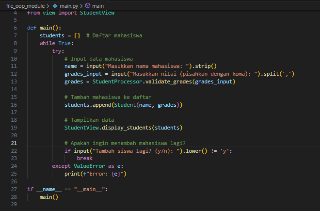
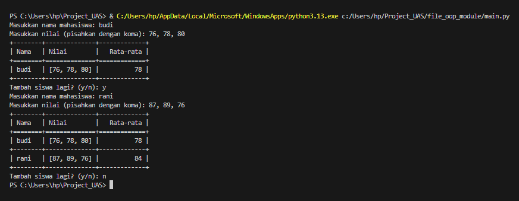

# Project_UAS

### Program python sederhana yang menggunakan oop dan modular.
### Program tentang menyimpan data Nilai mahasiswa

1. **File data.py (Class untuk Menyimpan Data Mahasiswa)**

     

     * **Penjelasan:**
         * Class Student digunakan untuk menyimpan informasi tentang satu mahasiswa, yaitu:
             - name: Nama mahasiswa.
             - grades: List nilai mahasiswa.
     * **Cara kerja:**
         - Ketika objek Student dibuat, pengguna harus memberikan nama dan nilai mahasiswa.
         - Data ini akan disimpan sebagai atribut objek, sehingga bisa digunakan di file lain.
 
2. **File process.py (Class untuk Memproses Data Mahasiswa)**

     

     * **Penjelasan:**
         - validate_grades: Memastikan nilai yang dimasukkan berupa angka valid dalam rentang 0-100.
         - calculate_average: Menghitung rata-rata dari nilai mahasiswa.
     * **Cara kerja:**
         * Validasi nilai (validate_grades)
             - Input berupa list nilai dalam bentuk string, seperti ["85", "90", "80"].
             - Program mengubahnya ke angka (integer).
             - Jika ada nilai yang tidak valid, program menampilkan pesan error.
         * Menghitung rata-rata (calculate_average)
             - Program menjumlahkan nilai dan membaginya.
 
3. **File view.py (Class untuk Menampilkan Data)**

     

     * **Penjelasan:**
         * Class ini bertugas untuk menampilkan data mahasiswa dalam bentuk tabel menggunakan pustaka tabulate.
             - Tabulate di harus di install di git bash (pip install tabulate).
     * **Cara kerja:**
         - Program mengambil daftar mahasiswa (list objek Student).
         - Data tiap mahasiswa diolah menjadi list: [nama, nilai, rata-rata].
         - Tabulate digunakan untuk merapikan data menjadi tabel.
 
4. **File main.py (Program Utama)**

     

     * **Penjelasan:**
         - Program meminta input nama dan nilai mahasiswa.
         - Nilai divalidasi menggunakan validate_grades.
         - Data mahasiswa disimpan ke dalam list.
         - Data mahasiswa ditampilkan menggunakan tabel.
     * **Cara kerja:**
         - Program meminta input nama dan nilai.
         - Nilai divalidasi agar sesuai (angka 0-100).
         - Jika valid, mahasiswa baru ditambahkan ke list.
         - Program menampilkan semua data mahasiswa.
         - Program terus berjalan hingga pengguna memilih keluar (n).
         
* **Kesimpulan**
     - File data.py: Menyimpan data mahasiswa (nama dan nilai).
     - File process.py: Memvalidasi nilai dan menghitung rata-rata.
     - File view.py: Menampilkan data mahasiswa dalam tabel.
     - File main.py: Menggabungkan semua fungsi dan menjalankan program.

### Contoh penggunaan program

